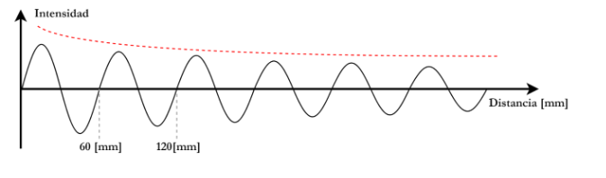
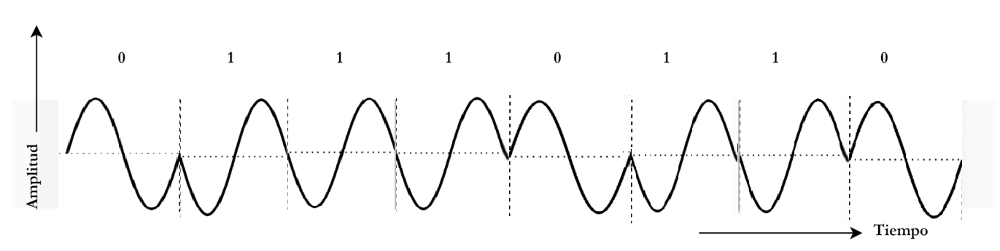

# TP1

# Integrantes :

- Enzo Nahuel Fernandez Mattio, 46225824, I.COMP
- Enzo Jesús Ferrando, 46320483, I.COMP
- Ignacio José Giraudo, 44900514, I.COMP
- Ezequiel Moreyra, 46226249, I.COMP

# 1)

**Resumen de conceptos básicos:**

- **Ondas electromagnéticas:** Son ondas formadas por campos eléctricos y magnéticos que se propagan por el espacio transportando energía. Se caracterizan principalmente por su frecuencia, longitud de onda y amplitud.
- **Modulación/Demodulación:** La modulación consiste en modificar una señal portadora para transmitir información. La demodulación es el proceso inverso, donde el receptor recupera la información original.
- **Señales de tiempo continuo:** Son señales que tienen un valor definido para cualquier instante de tiempo. Generalmente se representan como $x(t)$.
- **Señales de tiempo discreto:** Son señales cuyos valores están definidos solo en determinados instantes de tiempo, normalmente obtenidos mediante un proceso de muestreo. Se representan como $x[n]$.
1. **Qué frecuencia y longitud de onda tiene esta onda?. Considerar que viaja exactamente a la velocidad de la luz (C)**
    
    
    
    $\lambda = 60 \space [mm]$ (longitud de onda)
    
    $c = \lambda .f$ ⇒ $f=\dfrac{3\times10^8}{0.06}=5\times10^9\ \text{Hz}$ (frencuencia)
    
2. **El espectro EM está dividido en regiones y bandas. Investigar y mencionar en qué región del espectro opera esta onda, y más precisamente, en qué banda. Podés utilizar las definiciones de la ITU.**
    
    La onda opera en la región de las microondas y, según la clasificación de la ITU, pertenece a la banda **SHF**, que abarca desde 3 GHz hasta 30 GHz.
    
3. **Investigar qué dispositivos para comunicaciones de datos operan en esta banda y brindar al menos un ejemplo.**
    
    En esta banda operan dispositivos de comunicación Wi-Fi de 5 GHz, como routers, access points, notebooks y celulares. Un ejemplo es un **router Wi-Fi de 5 GHz**, utilizado para transmitir datos en una red inalámbrica.
    
4. **¿Qué fenómeno se quiere representar con la línea de trazos roja en la figura de la onda?**
    
    La línea roja representa la **atenuación**, es decir, la pérdida de intensidad de la señal a medida que aumenta la distancia recorrida.
    
5. **El fenómeno descrito en el ítem anterior, ¿Afecta al dispositivo que diste de ejemplo? ¿Podés notar esto en alguna experiencia de la vida cotidiana?**
    
    Sí, se puede percibir. Un ejemplo es la señal Wi-Fi que se debilita a medida que te alejás del router, bajando la velocidad de internet.
    
6. **El fenómeno descrito anteriormente:**
i) ¿Afecta a las transmisiones de telefonía celular?
    
    Sí, la atenuación en el espacio libre afecta cualquier transmisión inalámbrica
    ii) ¿Afecta a las transmisiones por cable coaxial?
    
    No, no es el mismo fenómeno. En el coaxial la señal viaja guiada dentro del conductor, no irradiada al espacio libre. 
    iii) ¿Afecta a las transmisiones por fibra óptica?
    
    No, no es el mismo fenómeno. En la fibra la señal es luz guiada por reflexión interna total dentro del núcleo, no una onda EM radiada. 
    

# 2)

1. **Según su direccionalidad y características temporales, ¿Qué tipo y modo de transmisión se quieren representar?**
    
    El sistema representa una transmisión **simplex y síncrona**. Es simplex porque la información viaja en un solo sentido, y síncrona porque transmisor y receptor comparten una señal de reloj.
    
2. **¿Es este el mejor paradigma si busco transmitir datos rápidamente y de forma bidireccional?**
    
    No. Si se busca transmitir datos rápidamente y en ambos sentidos conviene utilizar una comunicación **full-duplex**, que permite transmitir y recibir simultáneamente.
    
3. **Si quisiéramos transmitir la 4ta letra del nombre de tu grupo, ¿Cómo se vería la señal?, podés usar el siguiente gráfico para tu diagrama:**
    
    
    
4. **Dada la pendiente en los niveles de tensión que podemos ver indicada con flechas en el gráfico de ejemplo. ¿En qué marcas temporales medirían la señal para determinar el valor digital de la misma?**
    
    La señal debería medirse **en el centro de cada intervalo de bit**, donde el nivel de tensión ya es estable, evitando medir cerca de los flancos de subida o bajada porque el valor podría ser ambiguo.
    

# 3)

**Motivos por los cuales no conviene transmitir inalambricamente una señal escalonada:**

Una señal escalonada (banda base) tiene un espectro de frecuencias muy ancho (armónicos de alta frecuencia), lo que la hace poco práctica para el aire: requeriría un ancho de banda enorme, se atenúa y distorsiona fácilmente, y las antenas están diseñadas para radiar eficientemente en bandas de frecuencia acotadas, no en DC/banda base. Por eso se modula sobre una portadora senoidal de frecuencia conocida.

1. **¿Qué técnica de modulación se está representando?**
    
    
    La imagen muestra una modulación por desplazamiento de fase binaria o BPSK (Binary Phase Shift Keying). La amplitud y la frecuencia de la portadora se mantienen constantes, lo que codifica la información es la fase: cuando el bit cambia de 0 a 1 (o viceversa), se invierte la onda.
    
2. **¿Cómo se vería la siguiente señal digital modulada?** 

**c.    ¿Qué otras técnicas de modulación basadas en los mismos principios existen?**

Otras técnicas basadas en los mismos principios son OOK (On-Off Keying), un caso particular de ASK donde la amplitud es 0 para el bit "0", y QAM, que combina variaciones de amplitud y fase.

**d.    Qué es el Bit Error Rate (BER)?. En términos de BER, ¿Cuál de las técnicas de modulación presentadas anteriormente tiene mejores prestaciones?**

BER (Bit Error Rate) es la cantidad de bits recibidos con error sobre la cantidad total de bits transmitidos, en un período dado. Es la métrica estándar de calidad de un enlace digital. En términos de BER, ASK es la que peor se comporta frente al ruido y la atenuación, porque la información va codificada justamente en la amplitud (la variable más afectada por ruido e interferencias). Técnicas como FSK (frecuencia) y sobre todo PSK (fase) tienen mejor BER bajo las mismas condiciones de ruido.

# 4)

**c. Analizar las configuraciones del router y responder: ¿En qué frecuencia opera?
¿A qué región del espectro electromagnético corresponde? ¿En qué banda opera?**

El router opera a una frecuencia de 2,412 GHz, correspondiente al canal 1 de la banda inalámbrica configurada en Packet Tracer. Esta frecuencia se ubica dentro de la región de microondas del espectro electromagnético, y según la clasificación de bandas de la ITU, pertenece a la banda UHF (Ultra High Frequency), que abarca de 300 MHz a 3 GHz.

Una vez establecida la conexión inalámbrica entre la notebook y el router, se verificó la conectividad entre ambos dispositivos finales (PC y Notebook) mediante el comando ping. Ambos equipos obtuvieron una dirección IP asignada automáticamente por DHCP. El resultado del ping fue exitoso en ambos sentidos, confirmando que existe conectividad de capa de red entre los dos dispositivos a través del router, tanto por el enlace cableado (PC) como por el enlace inalámbrico (Notebook).

Se colocó la notebook en dos posiciones distintas dentro del área de cobertura Wi-Fi mostrada en la vista física de Packet Tracer, y se repitió la prueba de conectividad mediante ping en cada una:

1. **Notebook conectada lejos de la red:**

1. **Notebook conectada cerca de la red:**

Se observa que a medida que la notebook se aleja del router, la calidad del enlace inalámbrico se degrada, lo que se ve reflejado en el resultado de las pruebas de ping. Esto se debe a que la potencia de la señal recibida disminuye con la distancia por efecto de la atenuación en el medio, reduciendo la relación señal-ruido (SNR) del enlace.