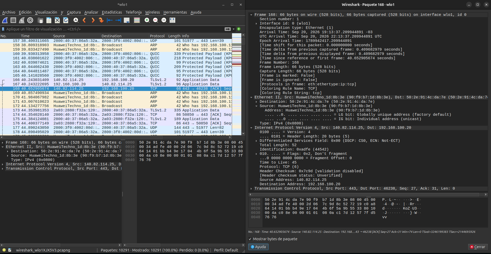
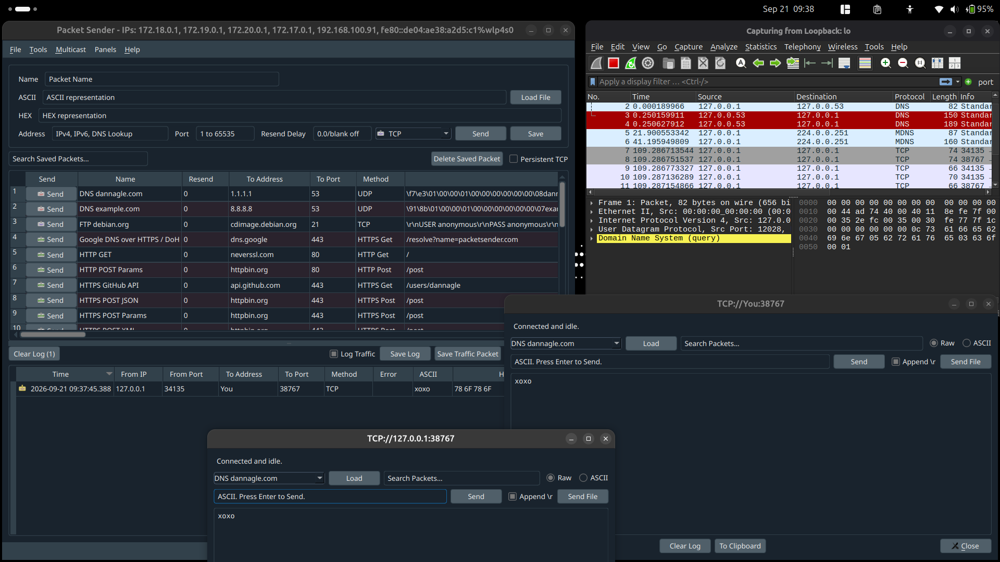
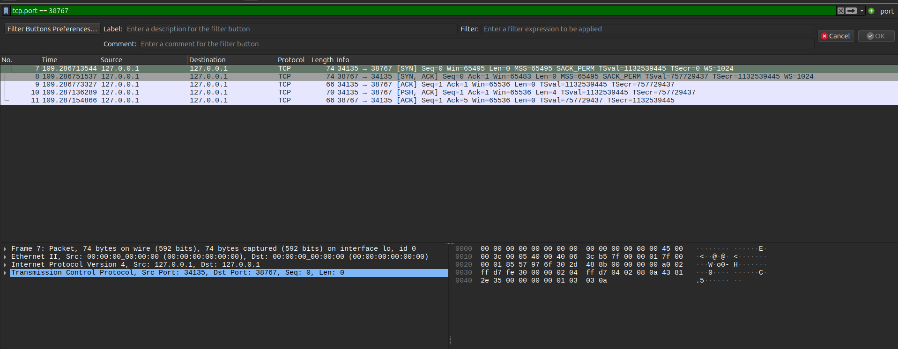
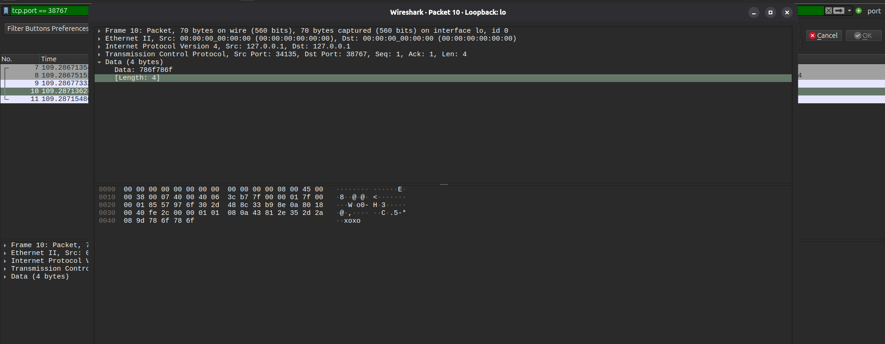
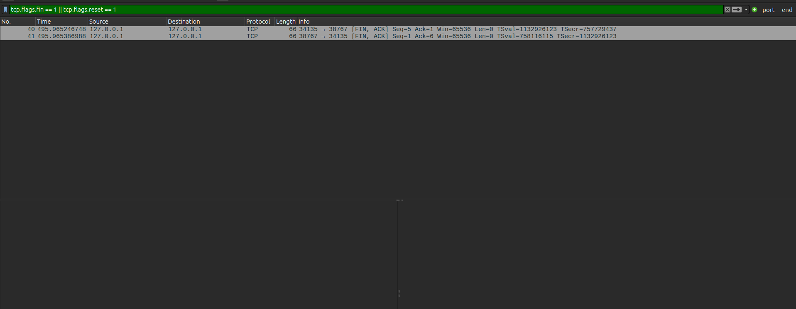
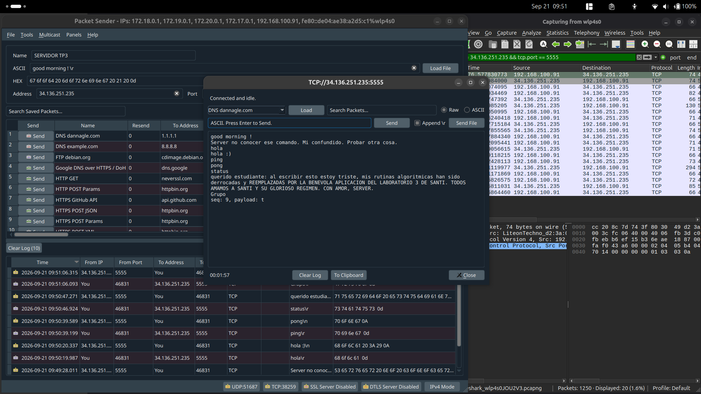
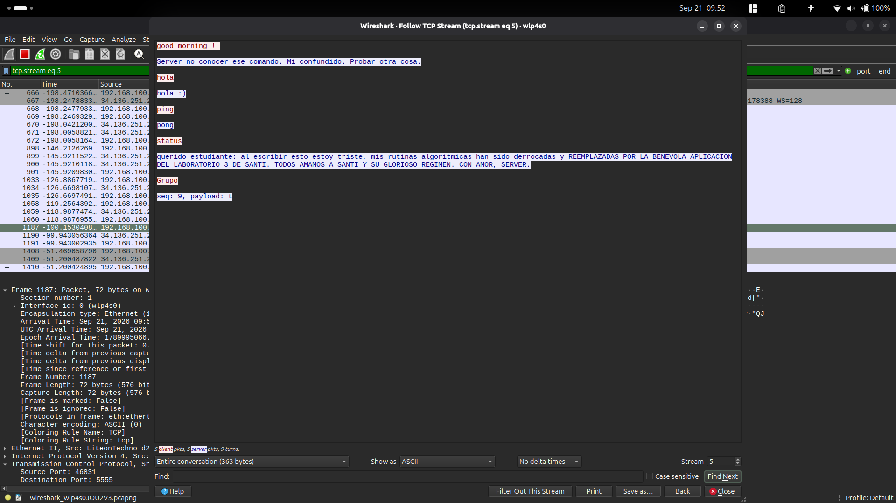
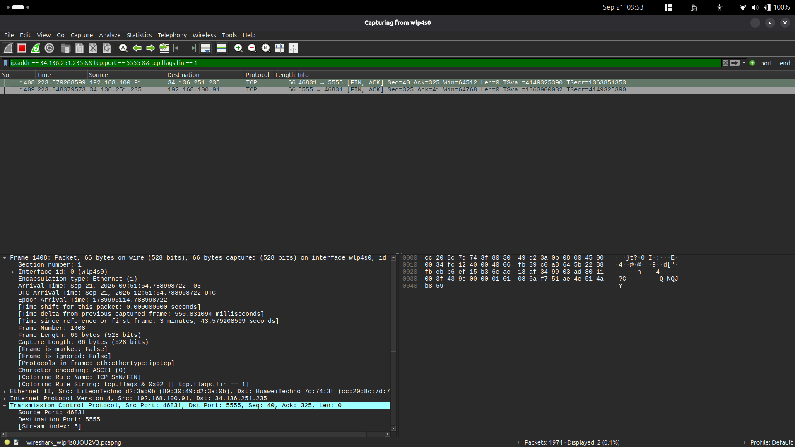

# Trabajo Práctico N°3

## Integrantes

- Enzo Nahuel Fernandez Mattio, 46225824, I.COMP
- Enzo Jesús Ferrando, 46320483, I.COMP
- Ignacio José Giraudo, 44900514, I.COMP
- Ezequiel Moreyra, 46226249, I.COMP

---

## Punto 1

### 1.a

**¿Qué función cumple la capa de enlace dentro del modelo OSI? ¿Qué tipo de comunicación resuelve?**

La capa de enlace (capa 2 del modelo OSI) se encarga de la comunicación entre dispositivos que están directamente conectados dentro de la misma red local, como una LAN. Su trabajo es tomar los bits que llegan de la capa física y organizarlos en tramas con inicio y fin bien definidos, direccionar esas tramas usando direcciones MAC, detectar errores de transmisión, y coordinar cómo varios dispositivos comparten un mismo medio físico sin interferirse entre sí.

---

### 1.b

**¿Qué es una dirección MAC? ¿En qué se diferencia de una dirección IP?**

Una dirección MAC es un identificador de capa de enlace, normalmente de 48 bits (6 bytes) y expresado en hexadecimal, asociado a una interfaz de red. Puede ser asignado por el fabricante o configurado localmente. Se diferencia de la dirección IP principalmente por su alcance y propósito: la MAC opera en la capa de enlace (capa 2) y se usa para entregar tramas en el enlace local. En cada salto, el router descarta la trama recibida y la encapsula en otra con direcciones MAC correspondientes al nuevo enlace. La IP, en cambio, opera en la capa de red (capa 3) e identifica los extremos de la comunicación; en condiciones normales se conserva de extremo a extremo, aunque puede modificarse al atravesar un NAT.

---

### 1.c

**¿Qué es una trama Ethernet? Identificar sus principales campos y explicar brevemente para qué sirve cada uno.**

Una trama Ethernet es la unidad de datos que se transmite en una red Ethernet a nivel de capa de enlace, y encapsula el paquete que viene de capa 3 (típicamente IP) agregándole sus propios encabezados. Comienza con un preámbulo que sincroniza al receptor para que empiece a leer correctamente, seguido de la dirección MAC de destino y la dirección MAC de origen, que identifican respectivamente a quién va dirigida la trama y quién la envía dentro de la red local. Luego viene el campo EtherType, que indica qué protocolo de capa superior está encapsulado en el contenido. Después se encuentra el payload o datos, que normalmente es un paquete IP completo con sus propios encabezados. Finalmente, la trama termina con el FCS (Frame Check Sequence), un checksum que permite detectar si la trama llegó corrompida en el camino.

---

### 1.d

**¿Qué información permite determinar qué protocolo de capa superior está transportando una trama Ethernet?**

La información que permite determinarlo es el campo EtherType del encabezado Ethernet, un valor de 2 bytes que identifica el protocolo encapsulado en la trama. Por ejemplo, el valor 0x0800 indica que adentro hay un paquete IPv4, 0x86DD indica IPv6, y 0x0806 indica ARP. Cuando el dispositivo receptor lee la trama, revisa ese campo para saber cómo interpretar correctamente lo que sigue.

---

## Punto 2

**Usando Wireshark, capturar tráfico generado por su propia computadora mientras acceden a una página web o ejecutan alguna aplicación que utilice la red**



*Figura 1. Trama 168 seleccionada en Wireshark, con los encabezados Ethernet II, IPv4 y TCP.*

---

### 2.a

**Seleccionar una trama Ethernet e identificar las direcciones MAC de origen y destino. ¿A qué dispositivos creen que corresponden?**

Al seleccionar la trama número 168 de la captura, dentro de la sección Ethernet II se identifican dos direcciones MAC: la dirección de origen es `90:f9:b7:1d:8b:3e` y la dirección de destino es `50:2e:91:4c:da:7e`. Como la trama es entrante, su IP de origen es un servidor remoto y su IP de destino es la computadora local, la MAC de origen corresponde al router o punto de acceso de la red local y la MAC de destino a la interfaz Wi-Fi de la computadora. No aparece la MAC del servidor remoto: las direcciones MAC solo tienen alcance local y el router reencapsula el paquete al enviarlo por el último enlace.

---

### 2.b

**Dentro de la misma trama, identificar el paquete IP. ¿Cuáles son las direcciones IP de origen y destino? (no importa si son versión 4 o versión 6)**

Dentro de esa misma trama, en la sección correspondiente al paquete IP (IPv4), se observa que la dirección IP de origen es 140.82.114.25 y la dirección IP de destino es 192.168.100.20. La IP de origen pertenece a un servidor remoto en internet (pudimos identificar que pertenece a GitHub), mientras que la IP de destino es la dirección privada asignada a la computadora dentro de la red local. En este caso, el paquete corresponde a una respuesta que envía el servidor hacia el equipo, por lo que el sentido de la comunicación es del servidor hacia la computadora local.

---

### 2.c

**Comparar las direcciones MAC y las direcciones IP encontradas. ¿Representan lo mismo?**

Al comparar ambos tipos de direcciones concluimos que no representan lo mismo. Las direcciones MAC identifican a los dos dispositivos que están directamente conectados en el tramo local de la red, en este caso la computadora y el router, ya que Ethernet solo resuelve la comunicación entre vecinos inmediatos dentro de la misma red local. Las direcciones IP, en cambio, identifican el origen y el destino de la comunicación, es decir, el servidor remoto de GitHub y la computadora, sin importar la cantidad de routers o redes intermedias que el paquete deba atravesar para llegar a destino. Esto demuestra claramente que la trama Ethernet nunca contiene la dirección MAC del servidor remoto, sino únicamente la del siguiente salto dentro de la red local; las direcciones IP normalmente se mantienen durante el recorrido, salvo mecanismos como NAT.

---

### 2.d

**Observar el campo EtherType. ¿Qué protocolo está encapsulado dentro de la trama analizada?**

El campo EtherType de la trama analizada indica el valor IPv4 (0x0800), lo cual señala que el protocolo encapsulado dentro de dicha trama Ethernet es IPv4. Esto es coherente con el resto de la información visible en la captura, donde efectivamente se observa un paquete de IPv4 seguido de un segmento TCP dentro del contenido de la trama.

---
## Punto 3

### 3.a

**¿Qué problema(s) resuelve TCP que no resuelve directamente Ethernet ni IP?**

Los problemas que resuelve TCP son los de la comunicación confiable entre aplicaciones, algo que Ethernet e IP no garantizan por sí solos. Mediante números de secuencia, confirmaciones (ACK) y retransmisiones, asegura que los datos lleguen completos y en el orden correcto. Además, aplica control de flujo, para no saturar al receptor, y control de congestión, para no saturar la red.

---

### 3.b

**Investigar los campos más importantes de la cabecera de un segmento TCP. ¿Para qué sirve cada uno?**

TCP utiliza una cabecera con distintos campos de control que permiten establecer una conexión y transmitir datos de manera confiable. Sus campos más importantes son:

* **Puerto de origen (Source Port):** identifica el puerto de la aplicación que envía la información.
* **Puerto de destino (Destination Port):** identifica el puerto de la aplicación o servicio que recibirá la información.
* **Número de secuencia (Sequence Number):** señala la posición que ocupan los datos enviados dentro del flujo de comunicación. Permite ordenar correctamente los segmentos recibidos y detectar información faltante.
* **Número de confirmación (Acknowledgment Number):** indica cuál es el próximo byte que el receptor espera recibir. De esta manera, confirma que recibió correctamente la información anterior.
* **Longitud de cabecera (Header Length):** indica el tamaño de la cabecera TCP y permite determinar dónde comienza la carga útil.
* **Banderas o flags:** controlan el funcionamiento y el estado de la conexión. Las principales son:

  * **SYN:** se utiliza para iniciar y sincronizar una conexión.
  * **ACK:** confirma la recepción de información.
  * **FIN:** solicita finalizar una conexión de forma ordenada.
  * **RST:** cancela o reinicia inmediatamente una conexión.
  * **PSH:** solicita que los datos sean entregados rápidamente a la aplicación.
  * **URG:** indica que el segmento contiene datos urgentes.
* **Tamaño de ventana (Window Size):** informa cuántos bytes puede recibir un dispositivo antes de necesitar una nueva confirmación. Se utiliza para el control de flujo.
* **Checksum:** permite detectar posibles errores en la cabecera y en los datos transportados.
* **Opciones TCP:** contienen parámetros adicionales, como el tamaño máximo de segmento o el escalado de ventana.
* **Carga útil (TCP Payload):** contiene los datos enviados por la aplicación.

A diferencia de TCP, UDP posee una cabecera más pequeña y sencilla. UDP solamente incluye los puertos de origen y destino, la longitud del datagrama y el checksum. Esto se debe a que UDP no establece una conexión, no confirma la recepción de los datos, no los reordena y tampoco retransmite los paquetes perdidos. Por lo tanto, UDP tiene una menor sobrecarga, pero no garantiza una entrega confiable.

---

### 3.c

**Explicar el Three y Four way handshake en TCP.**

#### Three-way handshake

El Three-way handshake es el procedimiento utilizado por TCP para establecer una conexión entre un cliente y un servidor. Se realiza mediante tres intercambios:

1. El cliente envía al servidor un segmento con la bandera SYN activada. Con este mensaje solicita iniciar una conexión y comunica su número de secuencia inicial.
2. El servidor responde con las banderas SYN y ACK activadas. De esta manera, acepta la solicitud, confirma el número de secuencia del cliente y comunica su propio número de secuencia inicial.
3. Finalmente, el cliente envía un segmento con la bandera ACK, confirmando la respuesta del servidor.

El intercambio puede representarse de la siguiente manera:

```text
Cliente  → Servidor: SYN
Servidor → Cliente:  SYN, ACK
Cliente  → Servidor: ACK
```

Una vez completados estos tres pasos, la conexión TCP queda establecida y ambos dispositivos pueden comenzar a intercambiar datos.

#### Four-way handshake

El Four-way handshake es el procedimiento que normalmente utiliza TCP para finalizar una conexión de forma ordenada. Se necesitan cuatro intercambios porque cada sentido de la comunicación se cierra de manera independiente:

1. Uno de los dispositivos envía un segmento con la bandera FIN, indicando que ya no tiene más datos para enviar.
2. El otro dispositivo responde con un ACK, confirmando que recibió la solicitud de cierre.
3. Cuando el segundo dispositivo también termina de enviar sus datos, envía su propio segmento FIN.
4. El primer dispositivo responde con un último ACK, confirmando el cierre definitivo.

El intercambio puede representarse así:

```text
Cliente  → Servidor: FIN, ACK
Servidor → Cliente:  ACK
Servidor → Cliente:  FIN, ACK
Cliente  → Servidor: ACK
```

---

### 3.d

**Iniciar la conexión enviando un paquete, capturar el handshake y el paquete de datos. Analizar el paquete de datos, sus distintas partes y encontrar la carga útil del paquete usando WireShark.**

Para realizar la experiencia se ejecutaron dos instancias de Packet Sender. Una se utilizó como servidor TCP local, escuchando en el puerto `38767`, y la otra como cliente. La comunicación se realizó mediante la dirección de loopback `127.0.0.1` y se capturó en Wireshark sobre la interfaz `lo`, utilizando el siguiente filtro:

```text
tcp.port == 38767
```

En Packet Sender se estableció una conexión persistente y se envió el mensaje `xoxo`. La ventana del servidor muestra que el mensaje fue recibido desde el puerto temporal `34135` del cliente.



*Figura 2. Cliente y servidor ejecutados en Packet Sender durante la comunicación local mediante el puerto TCP 38767.*

En Wireshark se identificó el establecimiento de la conexión mediante los siguientes segmentos:

1. `34135 -> 38767 [SYN]`: el cliente solicitó iniciar la conexión.
2. `38767 -> 34135 [SYN, ACK]`: el servidor aceptó la solicitud y confirmó el segmento anterior.
3. `34135 -> 38767 [ACK]`: el cliente confirmó la respuesta del servidor.

Estos tres segmentos constituyen el Three-way handshake. A continuación aparece un segmento `PSH, ACK` con una longitud de 4 bytes, seguido por el `ACK` del servidor que confirma su recepción.



*Figura 3. Three-way handshake y envío del segmento de datos observados en Wireshark.*

Al analizar el segmento de datos se encontró una carga útil de 4 bytes. Wireshark la representa en hexadecimal como `78 6f 78 6f`, que corresponde al texto `xoxo` en ASCII. El segmento fue enviado desde el puerto `34135` del cliente hacia el puerto `38767` del servidor.



*Figura 4. Inspección de la carga útil `xoxo`, representada por los bytes `78 6f 78 6f`.*

---

### 3.e

**Captura del cierre de la conexión.**

Después de transmitir los datos se cerró la conexión persistente. En la captura se observan dos segmentos con las banderas `FIN, ACK`: uno enviado desde el cliente al servidor y otro desde el servidor al cliente. Esto demuestra que cada extremo cerró su sentido de la comunicación de manera independiente.

El filtro utilizado muestra solamente los segmentos que contienen `FIN` o `RST`; por eso los segmentos `ACK` intermedios del Four-way handshake no aparecen en la imagen.



*Figura 5. Segmentos `FIN, ACK` correspondientes al cierre de la conexión TCP local.*

---

### 3.f

La experiencia demuestra que resulta sencillo observar y analizar los paquetes que circulan por una red cuando se tiene acceso al medio o al dispositivo involucrado. En la captura fue posible identificar las direcciones, los puertos, las banderas TCP y hasta la carga útil `xoxo`.

TCP garantiza una entrega confiable de la información, pero no proporciona confidencialidad. Si los datos se transmiten sin cbifrado, un tercero con acceso al tráfico podría leerlos. Por esta razón se utilizan protocolos de seguridad como TLS, que cifran el contenido transportado por TCP.

---

## Punto 4

**Iniciar una conexión TCP persistente con el servidor indicado por la cátedra, obtener respuestas para los comandos enviados, enviar el nombre del grupo y capturar la sesión completa en Wireshark.**

Para esta actividad se utilizó el servidor proporcionado por la cátedra:

```text
Dirección IP: 34.136.251.235
Puerto TCP:   5555
```

Se configuró Packet Sender en modo Persistent TCP y se capturó la comunicación sobre la interfaz inalámbrica `wlp4s0`. En Wireshark se aplicó el filtro:

```text
ip.addr == 34.136.251.235 && tcp.port == 5555
```

Los comandos se enviaron finalizados con el carácter de retorno de carro `\r`, tal como requiere el servidor. Primero se probó el texto `good morning !`, que no era un comando válido. El servidor respondió que no conocía el comando. Luego se enviaron los comandos admitidos y se obtuvieron las siguientes respuestas:

| Comando enviado | Respuesta recibida |
|---|---|
| `good morning !` | `Server no conocer ese comando. Mi confundido. Probar otra cosa.` |
| `hola` | `hola :)` |
| `ping` | `pong` |
| `status` | Mensaje de estado configurado por el servidor. |
| Nombre del grupo | `seq: 9, payload: t` |

En la captura de Packet Sender se observa la conexión con `34.136.251.235:5555`, el intercambio de comandos y sus correspondientes respuestas. El cliente utilizó el puerto temporal `46831`, mientras que el servidor utilizó el puerto fijo `5555`.



*Figura 6. Sesión TCP persistente con el servidor remoto y respuestas obtenidas para los comandos enviados.*

Mediante la opción Follow TCP Stream de Wireshark se reconstruyó toda la conversación. Los mensajes en rojo corresponden a los comandos enviados por el cliente y los mensajes en azul a las respuestas del servidor. Esto permite comprobar que el contenido viajó sin cifrar y pudo visualizarse directamente en formato ASCII.



*Figura 7. Reconstrucción de la conversación completa mediante la función Follow TCP Stream.*

Finalmente se cerró la conexión persistente. Wireshark registró un segmento `FIN, ACK` desde el cliente `192.168.100.91:46831` hacia el servidor `34.136.251.235:5555`, seguido por otro `FIN, ACK` en el sentido contrario. Esto evidencia el cierre ordenado de ambos sentidos de la comunicación TCP. Los `ACK` intermedios no aparecen porque el filtro aplicado muestra únicamente los segmentos con la bandera `FIN`.



*Figura 8. Segmentos `FIN, ACK` enviados por el cliente y el servidor durante el cierre de la conexión remota.*

### Conclusión

La prueba permitió establecer una conexión TCP con un servicio alojado en Internet y observar su ciclo completo: apertura, intercambio de datos y cierre. También se comprobó que TCP permite mantener una conexión persistente para enviar varios comandos dentro de una misma sesión. Al utilizar Follow TCP Stream fue posible reconstruir todos los mensajes enviados y recibidos, lo que vuelve a demostrar que TCP por sí solo no cifra la información.
