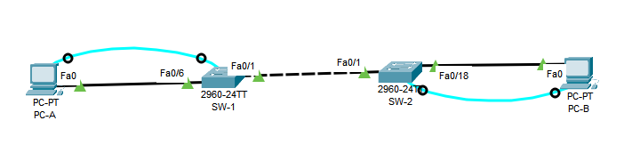

# Trabajo Práctico N°4

## Integrantes

- Enzo Nahuel Fernandez Mattio, 46225824, I.COMP
- Enzo Jesús Ferrando, 46320483, I.COMP
- Ignacio José Giraudo, 44900514, I.COMP
- Ezequiel Moreyra, 46226249, I.COMP

--- 
## Ejercicio 1: 
#### 1.a) 
Según su alcance geográfico, las redes se clasifican en:
* BAN (Body Area Network): es la red de dispositivos que una persona lleva puestos, como sensores médicos o relojes inteligentes. Tiene un alcance de 1 o 2 metros y es de muy bajo consumo.
* PAN (Personal Area Network): conecta los dispositivos de una misma persona dentro de unos 10 metros, por ejemplo el celular con los auriculares. Usa tecnologías como Bluetooth o USB.
* LAN (Local Area Network): cubre una oficina o un edificio, hasta alrededor de 1 km. Es privada, rápida y de baja latencia. Usa principalmente Ethernet y Wi-Fi.
* CAN (Campus Area Network): interconecta varias LAN de una misma organización en distintos edificios de un predio, como una universidad. Llega a unos pocos kilómetros.
* MAN (Metropolitan Area Network): abarca una ciudad y une LAN ubicadas en distintos puntos de ella. Suele pertenecer a un operador, como las redes de cable o de fibra metropolitana.
* WAN (Wide Area Network): se extiende sobre un país o continente usando la infraestructura de proveedores de servicios. Tiene mayor latencia y costo que una LAN. Por ejemplo, la red que une las sucursales de una empresa.
* GAN (Global Area Network): tiene alcance mundial. Su principal ejemplo es Internet, que interconecta redes de todo tipo mediante el protocolo IP.

De menor a mayor alcance: BAN, PAN, LAN, CAN, MAN, WAN y GAN.

Aclaracion: la figura mencionada en la consigna no se encuentra incluida en el enunciado del trabajo práctico, por lo que se presento la clasificación ordenada de menor a mayor alcance.

---

#### 1.b)
 Una VLAN (Virtual LAN) es una red lógica que agrupa puertos de uno o más switches en un mismo dominio de broadcast, sin importar dónde estén conectados físicamente los equipos. Un mismo switch se puede dividir en varias redes independientes. Los equipos de VLAN distintas no se comunican entre sí salvo que haya un router o un switch de capa 3. Las VLAN aportan seguridad, reducen el tráfico de broadcast y permiten reorganizar la red sin recablear.

Según cómo se asigna cada equipo a una VLAN, se clasifican en:

* Por puerto (estáticas): el administrador asigna cada puerto del switch a una VLAN. Es la más usada.
* Por dirección MAC (dinámicas): la VLAN depende de la MAC del equipo, que la conserva aunque cambie de puerto.
* Por protocolo o subred IP: la VLAN se asigna según el protocolo de red o la dirección IP de origen.

Según el tráfico que transportan, se distinguen:
* VLAN por defecto: es la VLAN 1, a la que pertenecen todos los puertos inicialmente.
* VLAN de datos: lleva el tráfico de los usuarios.
* VLAN nativa: su tráfico viaja sin etiqueta por los enlaces troncales.
* VLAN de administración: se usa para acceder a la gestión del switch.
* VLAN de voz: está dedicada a la telefonía IP, con prioridad sobre el resto del tráfico.

---

#### 1.c) 
IEEE 802.1Q es el estándar que define las VLAN en redes Ethernet. Establece cómo identificar a qué VLAN pertenece cada trama cuando varias VLAN comparten un mismo enlace.
Para eso, agrega a la trama Ethernet una etiqueta de 4 bytes, ubicada entre la MAC de origen y el campo EtherType. Esa etiqueta tiene estos campos:

* TPID: vale 0x8100 e indica que la trama está etiquetada.
* PCP: es la prioridad de la trama (0 a 7), usada para calidad de servicio.
* DEI: indica si la trama puede descartarse ante congestión.
* VID: son 12 bits con el número de VLAN, lo que permite usar las VLAN 1 a 4094.

Su relación con las VLAN es que permite extenderlas entre varios switches. Para eso distingue dos tipos de puertos. Los puertos de acceso pertenecen a una sola VLAN y envían las tramas sin etiqueta. Los puertos troncales transportan varias VLAN por un mismo enlace, y cada trama lleva su etiqueta.

---

#### 1.d) 
El tagging es el proceso de agregar la etiqueta 802.1Q, con el número de VLAN, a una trama que sale por un puerto troncal. El switch que la recibe lee la etiqueta, sabe a qué VLAN pertenece la trama y la quita antes de entregarla por un puerto de acceso.

Por ejemplo, en la topología del punto 2, si el enlace entre ambos switches se configura como troncal, una trama de PC-A sale del sw1 hacia el sw2 con la etiqueta de la VLAN 10. El sw2 le quita la etiqueta y se la entrega a PC-B. Así, tramas de distintas VLAN pueden compartir el mismo cable sin mezclarse. La única excepción es la VLAN nativa, cuyas tramas viajan sin etiqueta.

---

## Ejercicio 2:

### Topología



#### 2.a) b) c) d)
Desde la terminal de cada PC, conectada al switch por cable de consola, se configuró el nombre del switch, las contraseñas de modo privilegiado, consola y vty, el cifrado de contraseñas y la IP de la VLAN 1. Configuración aplicada en sw1 (en sw2 es igual, con hostname sw2 e IP 192.168.1.12):

```text
Switch>enable
Switch#configure terminal
Switch(config)#no ip domain-lookup
Switch(config)#hostname sw1
sw1(config)#enable secret class
sw1(config)#line console 0
sw1(config-line)#password cisco
sw1(config-line)#login
sw1(config-line)#exit
sw1(config)#line vty 0 15
sw1(config-line)#password cisco
sw1(config-line)#login
sw1(config-line)#exit
sw1(config)#service password-encryption
sw1(config)#interface vlan 1
sw1(config-if)#ip address 192.168.1.11 255.255.255.0
sw1(config-if)#no shutdown
```

Al volver a ingresar, el switch solicita la contraseña de consola y luego la privilegiada:

```text
User Access Verification

Password:

sw1>enable
Password:
sw1#
```

En la configuración se observa que las contraseñas de consola y vty quedan cifradas (tipo 7) por `service password-encryption`, y que la contraseña privilegiada se almacena como hash MD5 (tipo 5):

```text
sw1#show running-config
service password-encryption
!
hostname sw1
!
enable secret 5 $1$mERr$9cTjUIEqNGurQiFU.ZeCi1
...
interface Vlan1
 ip address 192.168.1.11 255.255.255.0
...
line con 0
 password 7 0822455D0A16
 login
!
line vty 0 4
 password 7 0822455D0A16
 login
line vty 5 15
 password 7 0822455D0A16
 login
```
---

#### 2.e)
Se desactivaron los puertos no utilizados (en sw2 el rango es `fa0/2-17, fa0/19-24, gi0/1-2`):

```text
sw1(config)#interface range fa0/2-5, fa0/7-24, gi0/1-2
sw1(config-if-range)#shutdown
```

Solo quedan activos Fa0/1 (enlace entre switches), Fa0/6 (PC-A) y la interfaz Vlan1:

```text
sw1#show ip interface brief
Interface              IP-Address      OK? Method Status                Protocol 
FastEthernet0/1        unassigned      YES manual up                    up 
FastEthernet0/2        unassigned      YES manual administratively down down 
FastEthernet0/3        unassigned      YES manual administratively down down 
FastEthernet0/4        unassigned      YES manual administratively down down 
FastEthernet0/5        unassigned      YES manual administratively down down 
FastEthernet0/6        unassigned      YES manual up                    up 
FastEthernet0/7        unassigned      YES manual administratively down down 
FastEthernet0/8        unassigned      YES manual administratively down down 
FastEthernet0/9        unassigned      YES manual administratively down down 
FastEthernet0/10       unassigned      YES manual administratively down down 
FastEthernet0/11       unassigned      YES manual administratively down down 
FastEthernet0/12       unassigned      YES manual administratively down down 
FastEthernet0/13       unassigned      YES manual administratively down down 
FastEthernet0/14       unassigned      YES manual administratively down down 
FastEthernet0/15       unassigned      YES manual administratively down down 
FastEthernet0/16       unassigned      YES manual administratively down down 
FastEthernet0/17       unassigned      YES manual administratively down down 
FastEthernet0/18       unassigned      YES manual administratively down down 
FastEthernet0/19       unassigned      YES manual administratively down down 
FastEthernet0/20       unassigned      YES manual administratively down down 
FastEthernet0/21       unassigned      YES manual administratively down down 
FastEthernet0/22       unassigned      YES manual administratively down down 
FastEthernet0/23       unassigned      YES manual administratively down down 
FastEthernet0/24       unassigned      YES manual administratively down down 
GigabitEthernet0/1     unassigned      YES manual administratively down down 
GigabitEthernet0/2     unassigned      YES manual administratively down down 
Vlan1                  192.168.1.11    YES manual up                    up
```

---

#### 2.f)
Se guardó la configuración en la NVRAM, para que se mantenga ante un reinicio:

```text
sw1#write memory
Building configuration...
[OK]
```
---

#### 2.g)
Ping de PC-A a PC-B:

```text
C:\>ping 192.168.10.4

Pinging 192.168.10.4 with 32 bytes of data:

Reply from 192.168.10.4: bytes=32 time<1ms TTL=128
Reply from 192.168.10.4: bytes=32 time<1ms TTL=128
Reply from 192.168.10.4: bytes=32 time<1ms TTL=128
Reply from 192.168.10.4: bytes=32 time<1ms TTL=128

Ping statistics for 192.168.10.4:
    Packets: Sent = 4, Received = 4, Lost = 0 (0% loss),
Approximate round trip times in milli-seconds:
    Minimum = 0ms, Maximum = 0ms, Average = 0ms
```

El ping es exitoso porque, por defecto, todos los puertos de ambos switches pertenecen a la VLAN 1, por lo que PC-A y PC-B están en el mismo dominio de broadcast y en la misma subred.

---

#### 2.h)
Se crearon las VLANs en ambos switches:

```text
sw1(config)#vlan 10
sw1(config-vlan)#name Laboratorio
sw1(config-vlan)#vlan 20
sw1(config-vlan)#name Bar
sw1(config-vlan)#vlan 99
sw1(config-vlan)#name Management
sw1(config-vlan)#end
```

---

#### 2.i)

```text
sw1#show vlan brief

VLAN Name                             Status    Ports
---- -------------------------------- --------- -------------------------------
1    default                          active    Fa0/1, Fa0/2, Fa0/3, Fa0/4
                                                Fa0/5, Fa0/6, Fa0/7, Fa0/8
                                                Fa0/9, Fa0/10, Fa0/11, Fa0/12
                                                Fa0/13, Fa0/14, Fa0/15, Fa0/16
                                                Fa0/17, Fa0/18, Fa0/19, Fa0/20
                                                Fa0/21, Fa0/22, Fa0/23, Fa0/24
                                                Gig0/1, Gig0/2
10   Laboratorio                      active    
20   Bar                              active    
99   Management                       active    
1002 fddi-default                     active    
1003 token-ring-default               active    
1004 fddinet-default                  active    
1005 trnet-default                    active    
```

La VLAN utilizada por defecto es la VLAN 1 ("default"), a la que pertenecen inicialmente todos los puertos del switch. Las VLAN 1002 a 1005 también vienen creadas por defecto y están reservadas para tecnologías antiguas (FDDI y Token Ring).

---

#### 2.j) k)
Se asignó PC-A (puerto Fa0/6) a la VLAN Laboratorio y se movió la IP de administración de la VLAN 1 a la VLAN 99:

```text
sw1(config)#interface fa0/6
sw1(config-if)#switchport mode access
sw1(config-if)#switchport access vlan 10
sw1(config-if)#interface vlan 1
sw1(config-if)#no ip address
sw1(config-if)#interface vlan 99
sw1(config-if)#ip address 192.168.1.11 255.255.255.0
sw1(config-if)#end
%LINK-5-CHANGED: Interface Vlan99, changed state to up
```

---

#### 2.l)

```text
sw1#show vlan brief

VLAN Name                             Status    Ports
---- -------------------------------- --------- -------------------------------
1    default                          active    Fa0/1, Fa0/2, Fa0/3, Fa0/4
                                                Fa0/5, Fa0/7, Fa0/8, Fa0/9
                                                Fa0/10, Fa0/11, Fa0/12, Fa0/13
                                                Fa0/14, Fa0/15, Fa0/16, Fa0/17
                                                Fa0/18, Fa0/19, Fa0/20, Fa0/21
                                                Fa0/22, Fa0/23, Fa0/24, Gig0/1
                                                Gig0/2
10   Laboratorio                      active    Fa0/6
20   Bar                              active    
99   Management                       active    
1002 fddi-default                     active    
1003 token-ring-default               active    
1004 fddinet-default                  active    
1005 trnet-default                    active    
```

```text
sw1#show ip interface brief
Interface              IP-Address      OK? Method Status                Protocol 
FastEthernet0/1        unassigned      YES manual up                    up 
FastEthernet0/2        unassigned      YES manual administratively down down 
FastEthernet0/3        unassigned      YES manual administratively down down 
FastEthernet0/4        unassigned      YES manual administratively down down 
FastEthernet0/5        unassigned      YES manual administratively down down 
FastEthernet0/6        unassigned      YES manual up                    up 
FastEthernet0/7        unassigned      YES manual administratively down down 
FastEthernet0/8        unassigned      YES manual administratively down down 
FastEthernet0/9        unassigned      YES manual administratively down down 
FastEthernet0/10       unassigned      YES manual administratively down down 
FastEthernet0/11       unassigned      YES manual administratively down down 
FastEthernet0/12       unassigned      YES manual administratively down down 
FastEthernet0/13       unassigned      YES manual administratively down down 
FastEthernet0/14       unassigned      YES manual administratively down down 
FastEthernet0/15       unassigned      YES manual administratively down down 
FastEthernet0/16       unassigned      YES manual administratively down down 
FastEthernet0/17       unassigned      YES manual administratively down down 
FastEthernet0/18       unassigned      YES manual administratively down down 
FastEthernet0/19       unassigned      YES manual administratively down down 
FastEthernet0/20       unassigned      YES manual administratively down down 
FastEthernet0/21       unassigned      YES manual administratively down down 
FastEthernet0/22       unassigned      YES manual administratively down down 
FastEthernet0/23       unassigned      YES manual administratively down down 
FastEthernet0/24       unassigned      YES manual administratively down down 
GigabitEthernet0/1     unassigned      YES manual administratively down down 
GigabitEthernet0/2     unassigned      YES manual administratively down down 
Vlan1                  unassigned      YES manual up                    up 
Vlan99                 192.168.1.11    YES manual up                    down
```

Con `show vlan brief` se verifica que el puerto Fa0/6 (PC-A) quedó asignado a la VLAN 10, mientras que el resto de los puertos, incluido Fa0/1 (enlace hacia sw2), permanece en la VLAN 1. Con `show ip interface brief` se observa que la IP de administración pasó a la interfaz Vlan99, que figura como up/down: está habilitada, pero su protocolo está caído porque ningún puerto activo pertenece a la VLAN 99. Por lo tanto, el switch no puede ser administrado por red hasta que la VLAN 99 tenga un puerto activo.

---

#### 2.m)
Se repitió la configuración en sw2, asignando PC-B (puerto Fa0/18) a la VLAN 10 y la IP 192.168.1.12 a la VLAN 99:

```text
sw2(config)#interface fa0/18
sw2(config-if)#switchport mode access
sw2(config-if)#switchport access vlan 10
sw2(config-if)#interface vlan 1
sw2(config-if)#no ip address
sw2(config-if)#interface vlan 99
sw2(config-if)#ip address 192.168.1.12 255.255.255.0
sw2(config-if)#end
%LINK-5-CHANGED: Interface Vlan99, changed state to up

sw2#write memory
Building configuration...
[OK]
```

---

#### 2.n)
Ping de PC-A a PC-B:

```text
C:\>ping 192.168.10.4

Pinging 192.168.10.4 with 32 bytes of data:

Request timed out.
Request timed out.
Request timed out.
Request timed out.

Ping statistics for 192.168.10.4:
    Packets: Sent = 4, Received = 0, Lost = 4 (100% loss),
```

Ping de sw1 a sw2:

```text
sw1#ping 192.168.1.12

Type escape sequence to abort.
Sending 5, 100-byte ICMP Echos to 192.168.1.12, timeout is 2 seconds:
.....
Success rate is 0 percent (0/5)
```

Ninguno de los dos pings es exitoso. PC-A y PC-B pertenecen a la misma VLAN (10) y a la misma subred, pero están conectadas a switches distintos, y el único enlace entre ellos (Fa0/1) es un puerto de acceso de la VLAN 1. Como un switch solo reenvía tramas entre puertos de la misma VLAN, el tráfico de la VLAN 10 no puede pasar de un switch al otro. Lo mismo ocurre con el ping entre sw1 y sw2: sus direcciones IP ahora están en la VLAN 99, que no tiene ningún puerto activo, por lo que no hay camino para ese tráfico. Para solucionarlo, el enlace entre ambos switches debe configurarse como troncal 802.1Q, de modo que transporte el tráfico de varias VLAN usando etiquetas (tagging).

---

## Ejercicio3:

i) Clase Turista: acceso solo a un sistema de entretenimiento (server local)

ii) Clase Business: acceso a sistema de entretenimiento e internet.

iii) Administración: acceso total.

### Diagrama Logico:


### Diagrama Fisico


### Configuracion del switch


### Configuracion del Router Aircraft

```text
Router#show ip interface brief
Interface              IP-Address      OK? Method Status                Protocol 
GigabitEthernet0/0/0   unassigned      YES unset  up                    up 
GigabitEthernet0/0/0.1010.10.10.1      YES manual up                    up 
GigabitEthernet0/0/0.2010.10.20.1      YES manual up                    up 
GigabitEthernet0/0/0.9910.10.99.1      YES manual up                    up 
GigabitEthernet0/0/1   200.0.0.1       YES manual up                    up 
GigabitEthernet0/0/2   unassigned      YES unset  down                  down 
GigabitEthernet0/0/3   unassigned      YES unset  down                  down 
```

### Configuracion del ISP

Probando con ping desde ISP hasta el Router Aircraft:

```text
Router#ping 200.0.0.1
Type escape sequence to abort.
Sending 5, 100-byte ICMP Echos to 200.0.0.1, timeout is 2 seconds:
!!!!!
Success rate is 100 percent (5/5), round-trip min/avg/max = 0/0/0 ms
```


### Configuracion del server

En los servicios del server, editamos el archivo que dice index.html, con el contenido que queremos ver:

```text
<html>
  <h1>AirConnect Entertainment</h1>
  <p>Bienvenido a bordo. Disfrute nuestras películas y música.</p>
</html>

```

### Configuracion de las notebooks:

En cada notebook conectada al switch, seleccionamos DHCP, para que automaticamente se genere un ip.

### Pruebas:

PC Turista hacia servidor:

```text
C:\>ping 10.10.99.10

Pinging 10.10.99.10 with 32 bytes of data:

Reply from 10.10.99.10: bytes=32 time<1ms TTL=127
Reply from 10.10.99.10: bytes=32 time<1ms TTL=127
Reply from 10.10.99.10: bytes=32 time<1ms TTL=127
Reply from 10.10.99.10: bytes=32 time<1ms TTL=127

Ping statistics for 10.10.99.10:
    Packets: Sent = 4, Received = 4, Lost = 0 (0% loss),

Approximate round trip times in milli-seconds:
    Minimum = 0ms, Maximum = 0ms, Average = 0ms
```

PC Turista accediendo al HTTPS del servidor:


PC Turista a internet (bloqueado):

```text
C:\>ping 8.8.8.8

Pinging 8.8.8.8 with 32 bytes of data:

Request timed out.
Request timed out.
Request timed out.
Request timed out.

Ping statistics for 8.8.8.8:
    Packets: Sent = 4, Received = 0, Lost = 4 (100% loss),
```

PC Business accediendo al HTTP del servidor:


PC Business a internet (permitido):

```text
C:\>ping 8.8.8.8

Pinging 8.8.8.8 with 32 bytes of data:

Reply from 8.8.8.8: bytes=32 time<1ms TTL=254
Reply from 8.8.8.8: bytes=32 time<1ms TTL=254
Reply from 8.8.8.8: bytes=32 time<1ms TTL=254
Reply from 8.8.8.8: bytes=32 time<1ms TTL=254

Ping statistics for 8.8.8.8:
    Packets: Sent = 4, Received = 4, Lost = 0 (0% loss),

Approximate round trip times in milli-seconds:
    Minimum = 0ms, Maximum = 0ms, Average = 0ms
```

Ping entre admin y todos:

```text
C:\>ping 10.10.99.10

Pinging 10.10.99.10 with 32 bytes of data:

Reply from 10.10.99.10: bytes=32 time<1ms TTL=128
Reply from 10.10.99.10: bytes=32 time<1ms TTL=128
Reply from 10.10.99.10: bytes=32 time<1ms TTL=128
Reply from 10.10.99.10: bytes=32 time<1ms TTL=128

Ping statistics for 10.10.99.10:
    Packets: Sent = 4, Received = 4, Lost = 0 (0% loss),

Approximate round trip times in milli-seconds:
    Minimum = 0ms, Maximum = 0ms, Average = 0ms


C:\>ping 8.8.8.8

Pinging 8.8.8.8 with 32 bytes of data:

Reply from 8.8.8.8: bytes=32 time<1ms TTL=254
Reply from 8.8.8.8: bytes=32 time<1ms TTL=254
Reply from 8.8.8.8: bytes=32 time<1ms TTL=254
Reply from 8.8.8.8: bytes=32 time<1ms TTL=254

Ping statistics for 8.8.8.8:
    Packets: Sent = 4, Received = 4, Lost = 0 (0% loss),

Approximate round trip times in milli-seconds:
    Minimum = 0ms, Maximum = 0ms, Average = 0ms


C:\>ping 10.10.10.11

Pinging 10.10.10.11 with 32 bytes of data:

Reply from 10.10.10.11: bytes=32 time<1ms TTL=127
Reply from 10.10.10.11: bytes=32 time<1ms TTL=127
Reply from 10.10.10.11: bytes=32 time<1ms TTL=127
Reply from 10.10.10.11: bytes=32 time<1ms TTL=127

Ping statistics for 10.10.10.11:
    Packets: Sent = 4, Received = 4, Lost = 0 (0% loss),

Approximate round trip times in milli-seconds:
    Minimum = 0ms, Maximum = 0ms, Average = 0ms


C:\>ping 10.10.20.11

Pinging 10.10.20.11 with 32 bytes of data:

Reply from 10.10.20.11: bytes=32 time<1ms TTL=127
Reply from 10.10.20.11: bytes=32 time<1ms TTL=127
Reply from 10.10.20.11: bytes=32 time<1ms TTL=127
Reply from 10.10.20.11: bytes=32 time=1ms TTL=127

Ping statistics for 10.10.20.11:
    Packets: Sent = 4, Received = 4, Lost = 0 (0% loss),

Approximate round trip times in milli-seconds:
    Minimum = 0ms, Maximum = 1ms, Average = 0ms
```


### Conclusiones: 

En el ejercicio 2 se pudo ver que una VLAN define un dominio de broadcast propio: aunque PC-A y PC-B compartieran subred y estuvieran en la misma VLAN, al no existir un enlace troncal entre sw1 y sw2 el tráfico quedó aislado y los pings fallaron. Esto deja en claro que extender una VLAN entre switches requiere configurar el enlace como troncal 802.1Q, para que las tramas viajen etiquetadas y cada switch sepa a qué VLAN pertenecen.
Luego, en el ejercicio 3, se pudo separar el tráfico de forma simple y segura usando VLANs y un router. Con el etiquetado 802.1Q se dividieron las clases del avión en un mismo switch, mientras que las subinterfaces del router se encargaron del DHCP y del ruteo entre redes.
Por último, combinando ACLs y NAT se logró el control de acceso que pedía la consigna: Turista solo llega al servidor local sin poder salir a la red externa, mientras que Business y Admin comparten la salida a Internet traduciendo sus IPs privadas con una sola IP pública.

