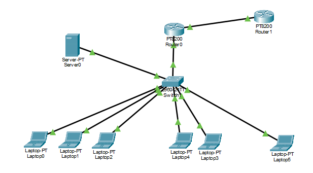
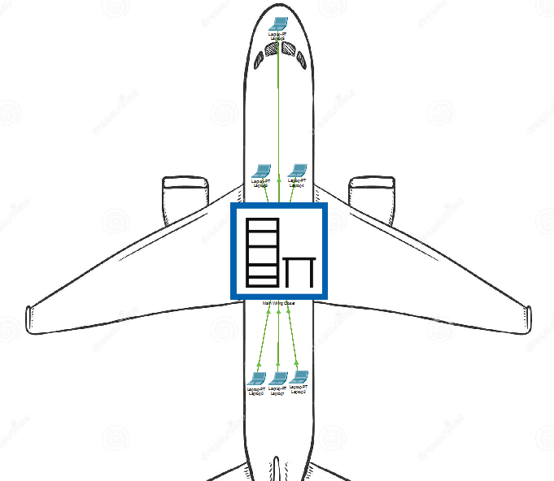
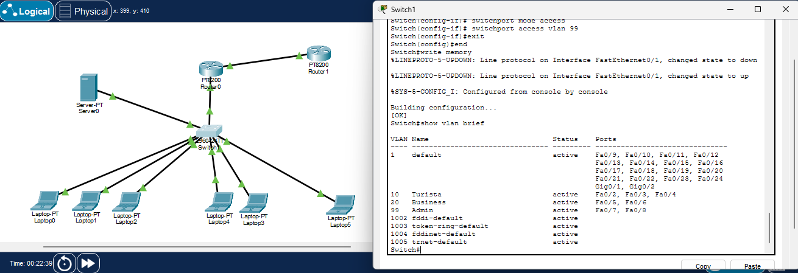
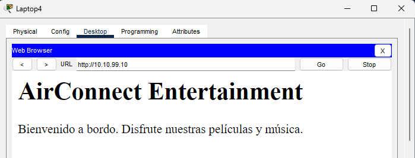

# Trabajo Práctico N°4

## Integrantes

- Enzo Nahuel Fernandez Mattio, 46225824, I.COMP
- Enzo Jesús Ferrando, 46320483, I.COMP
- Ignacio José Giraudo, 44900514, I.COMP
- Ezequiel Moreyra, 46226249, I.COMP

--- 
## Ejercicio 1: Investigación teórica Alcance de Redes y Virtualización
#### A) 
Según su alcance geográfico, las redes se clasifican en:
* BAN (Body Area Network): es la red de dispositivos que una persona lleva puestos, como sensores médicos o relojes inteligentes. Tiene un alcance de 1 o 2 metros y es de muy bajo consumo.
* PAN (Personal Area Network): conecta los dispositivos de una misma persona dentro de unos 10 metros, por ejemplo el celular con los auriculares. Usa tecnologías como Bluetooth o USB.
* LAN (Local Area Network): cubre una oficina o un edificio, hasta alrededor de 1 km. Es privada, rápida y de baja latencia. Usa principalmente Ethernet y Wi-Fi.
* CAN (Campus Area Network): interconecta varias LAN de una misma organización en distintos edificios de un predio, como una universidad. Llega a unos pocos kilómetros.
* MAN (Metropolitan Area Network): abarca una ciudad y une LAN ubicadas en distintos puntos de ella. Suele pertenecer a un operador, como las redes de cable o de fibra metropolitana.
* WAN (Wide Area Network): se extiende sobre un país o continente usando la infraestructura de proveedores de servicios. Tiene mayor latencia y costo que una LAN. Por ejemplo, la red que une las sucursales de una empresa.
* GAN (Global Area Network): tiene alcance mundial. Su principal ejemplo es Internet, que interconecta redes de todo tipo mediante el protocolo IP.

De menor a mayor alcance: BAN, PAN, LAN, CAN, MAN, WAN y GAN.

#### B)
 Una VLAN (Virtual LAN) es una red lógica que agrupa puertos de uno o más switches en un mismo dominio de broadcast, sin importar dónde estén conectados físicamente los equipos. Un mismo switch se puede dividir en varias redes independientes. Los equipos de VLAN distintas no se comunican entre sí salvo que haya un router o un switch de capa 3. Las VLAN aportan seguridad, reducen el tráfico de broadcast y permiten reorganizar la red sin recablear.

Según cómo se asigna cada equipo a una VLAN, se clasifican en:

* Por puerto (estáticas): el administrador asigna cada puerto del switch a una VLAN. Es la más usada.
* Por dirección MAC (dinámicas): la VLAN depende de la MAC del equipo, que la conserva aunque cambie de puerto.
* Por protocolo o subred IP: la VLAN se asigna según el protocolo de red o la dirección IP de origen.

Según el tráfico que transportan, se distinguen:
* VLAN por defecto: es la VLAN 1, a la que pertenecen todos los puertos inicialmente.
* VLAN de datos: lleva el tráfico de los usuarios.
* VLAN nativa: su tráfico viaja sin etiqueta por los enlaces troncales.
* VLAN de administración: se usa para acceder a la gestión del switch.
* VLAN de voz: está dedicada a la telefonía IP, con prioridad sobre el resto del tráfico.

#### C) 
IEEE 802.1Q es el estándar que define las VLAN en redes Ethernet. Establece cómo identificar a qué VLAN pertenece cada trama cuando varias VLAN comparten un mismo enlace.
Para eso, agrega a la trama Ethernet una etiqueta de 4 bytes, ubicada entre la MAC de origen y el campo EtherType. Esa etiqueta tiene estos campos:

* TPID: vale 0x8100 e indica que la trama está etiquetada.
* PCP: es la prioridad de la trama (0 a 7), usada para calidad de servicio.
* DEI: indica si la trama puede descartarse ante congestión.
* VID: son 12 bits con el número de VLAN, lo que permite usar las VLAN 1 a 4094.

Su relación con las VLAN es que permite extenderlas entre varios switches. Para eso distingue dos tipos de puertos. Los puertos de acceso pertenecen a una sola VLAN y envían las tramas sin etiqueta. Los puertos troncales transportan varias VLAN por un mismo enlace, y cada trama lleva su etiqueta.

#### D) 
El tagging es el proceso de agregar la etiqueta 802.1Q, con el número de VLAN, a una trama que sale por un puerto troncal. El switch que la recibe lee la etiqueta, sabe a qué VLAN pertenece la trama y la quita antes de entregarla por un puerto de acceso.

Por ejemplo, en la topología del punto 2, una trama de PC-A sale del sw1 hacia el sw2 con la etiqueta de la VLAN 10. El sw2 le quita la etiqueta y se la entrega a PC-B. Así, tramas de distintas VLAN pueden compartir el mismo cable sin mezclarse. La única excepción es la VLAN nativa, cuyas tramas viajan sin etiqueta.
## Ejercicio3: LAN en un avión

i) Clase Turista: acceso solo a un sistema de entretenimiento (server local)
ii) Clase Business: acceso a sistema de entretenimiento e internet.
iii) Administración: acceso total.

### Diagrama Logico:



### Diagrama Fisico



### Configuracion del switch




### Configuracion del Router Aircraft

```text
Router#show ip interface brief
Interface              IP-Address      OK? Method Status                Protocol 
GigabitEthernet0/0/0   unassigned      YES unset  up                    up 
GigabitEthernet0/0/0.1010.10.10.1      YES manual up                    up 
GigabitEthernet0/0/0.2010.10.20.1      YES manual up                    up 
GigabitEthernet0/0/0.9910.10.99.1      YES manual up                    up 
GigabitEthernet0/0/1   200.0.0.1       YES manual up                    up 
GigabitEthernet0/0/2   unassigned      YES unset  down                  down 
GigabitEthernet0/0/3   unassigned      YES unset  down                  down 
```

### Configuracion del ISP

Probando con ping desde ISP hasta el Router Aircraft:

```text
Router#ping 200.0.0.1
Type escape sequence to abort.
Sending 5, 100-byte ICMP Echos to 200.0.0.1, timeout is 2 seconds:
!!!!!
Success rate is 100 percent (5/5), round-trip min/avg/max = 0/0/0 ms
```


### Configuracion del server

En los servicios del server, editamos el archivo que dice index.html, con el contenido que queremos ver:

```text
<html>
  <h1>AirConnect Entertainment</h1>
  <p>Bienvenido a bordo. Disfrute nuestras películas y música.</p>
</html>

```

### Configuracion de las notebooks:

En cada notebook conectada al switch, seleccionamos DHCP, para que automaticamente se genere un ip.

### Pruebas:

PC Turista hacia servidor:

```text
C:\>ping 10.10.99.10

Pinging 10.10.99.10 with 32 bytes of data:

Reply from 10.10.99.10: bytes=32 time<1ms TTL=127
Reply from 10.10.99.10: bytes=32 time<1ms TTL=127
Reply from 10.10.99.10: bytes=32 time<1ms TTL=127
Reply from 10.10.99.10: bytes=32 time<1ms TTL=127

Ping statistics for 10.10.99.10:
    Packets: Sent = 4, Received = 4, Lost = 0 (0% loss),

Approximate round trip times in milli-seconds:
    Minimum = 0ms, Maximum = 0ms, Average = 0ms
```

PC Turista accediendo al HTTPS del servidor:


PC Turista a internet (bloqueado):

```text
C:\>ping 8.8.8.8

Pinging 8.8.8.8 with 32 bytes of data:

Request timed out.
Request timed out.
Request timed out.
Request timed out.

Ping statistics for 8.8.8.8:
    Packets: Sent = 4, Received = 0, Lost = 4 (100% loss),
```

PC Business accediendo al HTTPS del servidor:



PC Business a internet (permitido):

```text
C:\>ping 8.8.8.8

Pinging 8.8.8.8 with 32 bytes of data:

Reply from 8.8.8.8: bytes=32 time<1ms TTL=254
Reply from 8.8.8.8: bytes=32 time<1ms TTL=254
Reply from 8.8.8.8: bytes=32 time<1ms TTL=254
Reply from 8.8.8.8: bytes=32 time<1ms TTL=254

Ping statistics for 8.8.8.8:
    Packets: Sent = 4, Received = 4, Lost = 0 (0% loss),

Approximate round trip times in milli-seconds:
    Minimum = 0ms, Maximum = 0ms, Average = 0ms
```

Ping entre admin y todos:

```text
C:\>ping 10.10.99.10

Pinging 10.10.99.10 with 32 bytes of data:

Reply from 10.10.99.10: bytes=32 time<1ms TTL=128
Reply from 10.10.99.10: bytes=32 time<1ms TTL=128
Reply from 10.10.99.10: bytes=32 time<1ms TTL=128
Reply from 10.10.99.10: bytes=32 time<1ms TTL=128

Ping statistics for 10.10.99.10:
    Packets: Sent = 4, Received = 4, Lost = 0 (0% loss),

Approximate round trip times in milli-seconds:
    Minimum = 0ms, Maximum = 0ms, Average = 0ms


C:\>ping 8.8.8.8

Pinging 8.8.8.8 with 32 bytes of data:

Reply from 8.8.8.8: bytes=32 time<1ms TTL=254
Reply from 8.8.8.8: bytes=32 time<1ms TTL=254
Reply from 8.8.8.8: bytes=32 time<1ms TTL=254
Reply from 8.8.8.8: bytes=32 time<1ms TTL=254

Ping statistics for 8.8.8.8:
    Packets: Sent = 4, Received = 4, Lost = 0 (0% loss),

Approximate round trip times in milli-seconds:
    Minimum = 0ms, Maximum = 0ms, Average = 0ms


C:\>ping 10.10.10.11

Pinging 10.10.10.11 with 32 bytes of data:

Reply from 10.10.10.11: bytes=32 time<1ms TTL=127
Reply from 10.10.10.11: bytes=32 time<1ms TTL=127
Reply from 10.10.10.11: bytes=32 time<1ms TTL=127
Reply from 10.10.10.11: bytes=32 time<1ms TTL=127

Ping statistics for 10.10.10.11:
    Packets: Sent = 4, Received = 4, Lost = 0 (0% loss),

Approximate round trip times in milli-seconds:
    Minimum = 0ms, Maximum = 0ms, Average = 0ms


C:\>ping 10.10.20.11

Pinging 10.10.20.11 with 32 bytes of data:

Reply from 10.10.20.11: bytes=32 time<1ms TTL=127
Reply from 10.10.20.11: bytes=32 time<1ms TTL=127
Reply from 10.10.20.11: bytes=32 time<1ms TTL=127
Reply from 10.10.20.11: bytes=32 time=1ms TTL=127

Ping statistics for 10.10.20.11:
    Packets: Sent = 4, Received = 4, Lost = 0 (0% loss),

Approximate round trip times in milli-seconds:
    Minimum = 0ms, Maximum = 1ms, Average = 0ms
```


### Conclusiones: 

La práctica permitió comprobar cómo separar el tráfico de forma simple y segura usando VLANs y un router. Con el etiquetado 802.1Q se dividieron las clases del avión en un mismo switch, mientras que las subinterfaces del router se encargaron del DHCP y del ruteo entre redes.
Por último, combinando ACLs y NAT se logró el control de acceso que pedía la consigna: Turista solo llega al servidor local sin poder salir a la red externa, mientras que Business y Admin comparten la salida a Internet traduciendo sus IPs privadas con una sola IP pública.

